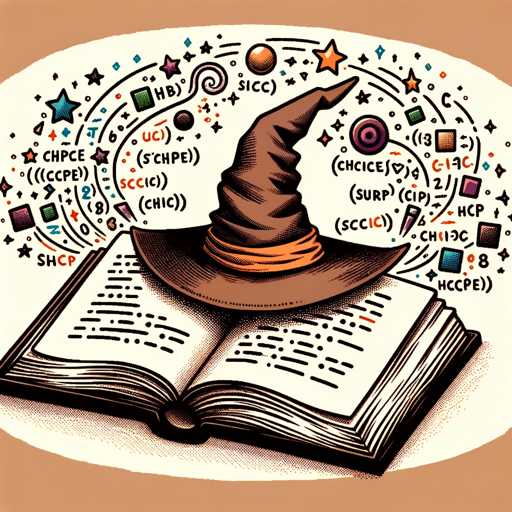
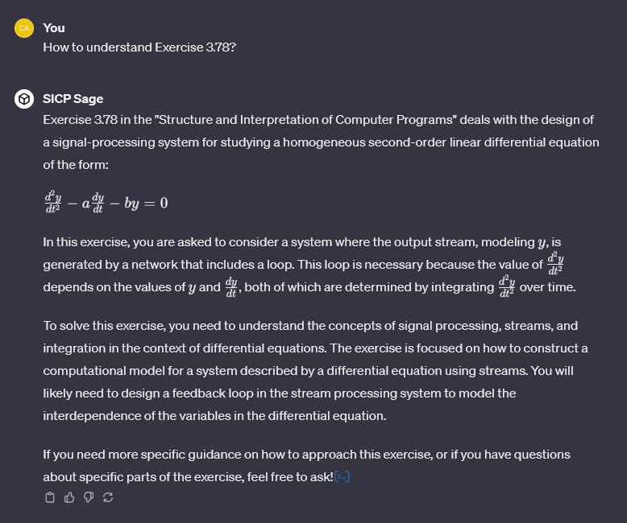
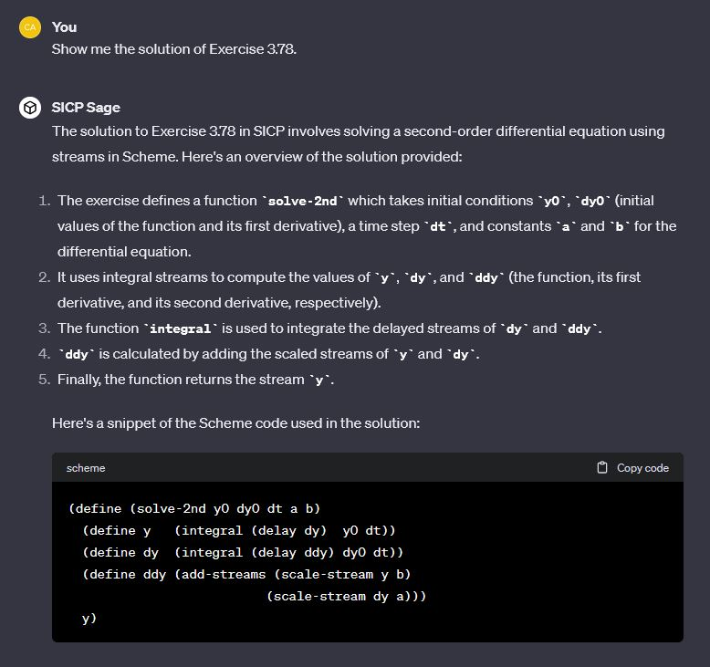

# SICP-Sage
An academic assistant for SICP study, referencing solutions

## URL

https://chat.openai.com/g/g-Jd8EjuxN9-sicp-sage

## Screenshot

## Knowledge Base

- SICP book
  - https://github.com/ilmotta/sicp-org
- SICP solution
  - https://gitlab.com/Lockywolf/chibi-sicp
  - https://github.com/chansey97/sicp (my own sicp solutions via Racket)

